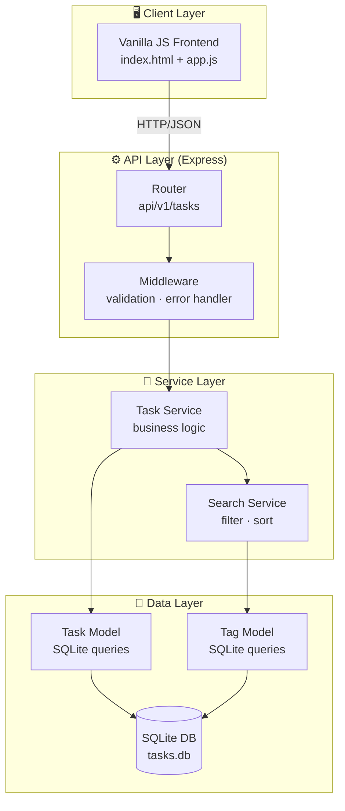
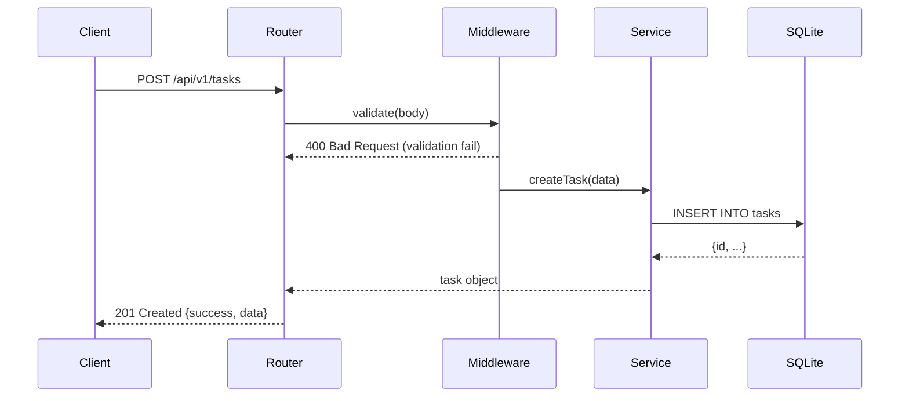
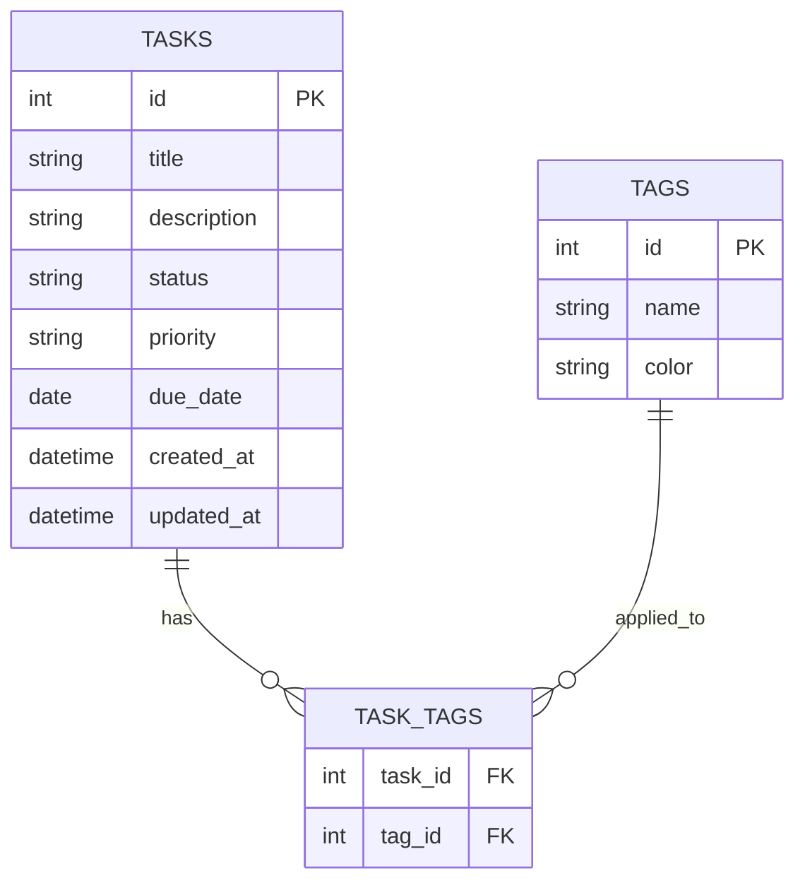

# ARCHITECTURE.md — Personal Task Tracker

## Системийн архитектур



## Давхаргын тайлбар

| Давхарга | Файл | Үүрэг |
|---------|------|-------|
| Router | `src/routes/tasks.js` | HTTP endpoint тодорхойлох, request/response |
| Middleware | `src/middleware/validate.js` | Input validation, error handling |
| Service | `src/services/task.service.js` | Бизнесийн логик |
| Model | `src/models/task.model.js` | SQLite CRUD query |
| DB | `src/db/schema.sql` | Хүснэгтийн бүтэц |

## Өгөгдлийн урсгал



## Өгөгдлийн загвар (Schema)



## Директор бүтэц

```
partB/
├── src/
│   ├── index.js              # Entry point, Express app
│   ├── db/
│   │   ├── schema.sql        # Хүснэгтийн бүтэц
│   │   ├── migrate.js        # Migration runner
│   │   └── seed.js           # Test өгөгдөл
│   ├── routes/
│   │   ├── tasks.js          # /api/v1/tasks
│   │   └── tags.js           # /api/v1/tags
│   ├── models/
│   │   ├── task.model.js     # Task CRUD queries
│   │   └── tag.model.js      # Tag queries
│   ├── services/
│   │   └── task.service.js   # Business logic
│   └── middleware/
│       ├── validate.js       # express-validator rules
│       └── errorHandler.js   # Global error handler
├── tests/
│   ├── task.model.test.js
│   ├── task.routes.test.js
│   └── task.service.test.js
├── public/
│   ├── index.html
│   └── app.js
└── package.json
```
